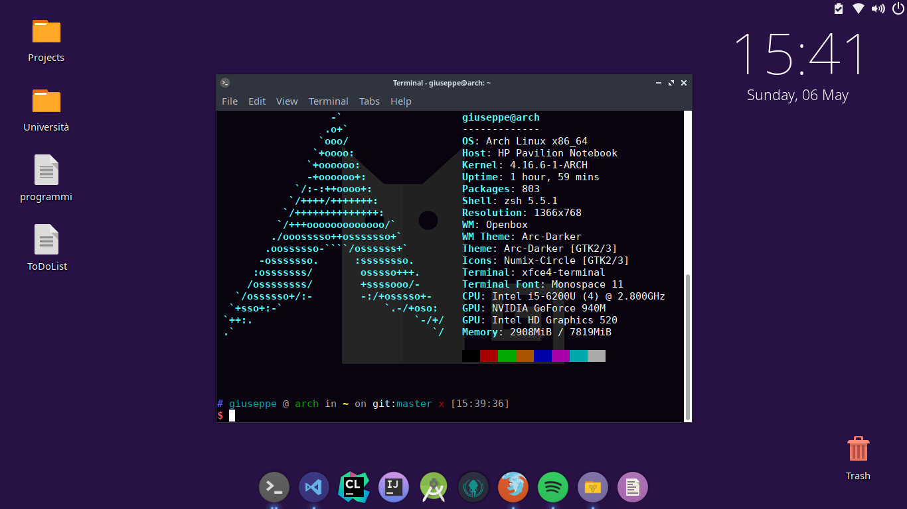
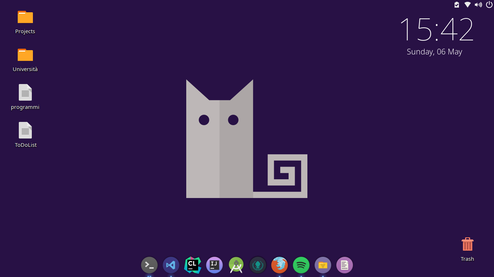
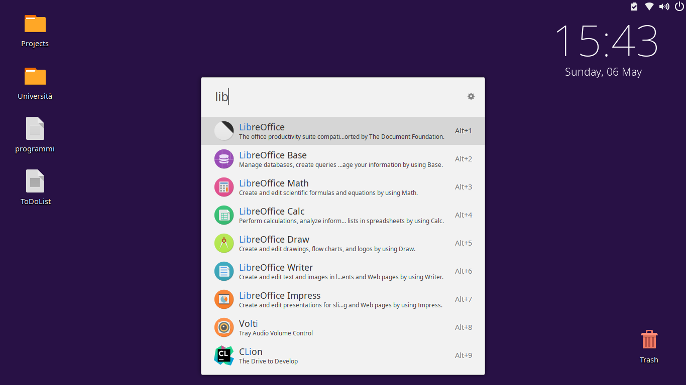

# openbox-dotfiles

- **Icons:** [Numix-Circle](https://github.com/numixproject/numix-icon-theme-circle)
- **Dock:** [Plank](https://launchpad.net/plank)
- **Theme:** [Arc-Darker](https://github.com/horst3180/arc-theme)
- **Conky:** [Jelly](https://github.com/zagortenay333/jelly-conky)
- **Compositor:** Compton
- **TrayBar:** Trayer
- **Application Launcher:** [Ulauncher](https://ulauncher.io/)
- **Terminal:** Xfce4-terminal
- **File Manager:** Thunar

# Terminal

# Desktop

# Application Launcher

